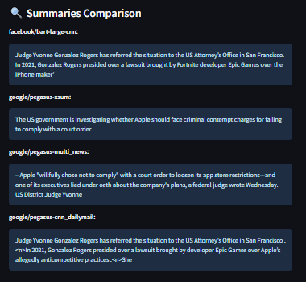

# 📄 **Technical Report: News Summarization App**

**Author:** Gregory Barbas  
**Project:** LLM_Finance_Summaries  
**Date:** 05 May 2025

## 1️⃣ **Introduction**

This report documents the development of a news summarization application as part of an interview assignment. The app ingests news articles, generates summaries using pre-trained transformer models, evaluates their quality, and exposes the results via an interactive Streamlit interface.

The report includes the technical choices made, their rationale, challenges encountered, evaluation metrics, and example outputs.

----------

## 2️⃣ **Technical Choices**

### **2.1 Tech Stack Choices**

-   **Streamlit** for rapid prototyping of an interactive UI
    
-   **Docker** for environment consistency and deployment
    
-   **Hugging Face Transformers** for model loading/inference
    
-   **spaCy + NLTK** for light preprocessing
    
-   **`evaluate` library** for ROUGE, BLEU, METEOR, BERTScore metrics
    

✅ **Reasoning:**  
These libraries enabled me to focus on building features without reinventing tools for NLP, while also keeping the system modular for experimentation.

### 2.2 **Model Selection**

For this project, we explored four pre-trained transformer-based summarization models:

| Model | Architecture | Pre-training Dataset |
|--|--|--|
| facebook/bart-large-cnn | BART | CNN/DailyMail |
| google/pegasus-cnn_dailymail | PEGASUS | CNN/DailyMail |
| google/pegasus-xsum | PEGASUS | XSum |
| google/pegasus-multi_news | PEGASUS | Multi-News |

Additionally, we fine-tuned the `sshleifer/distilbart-cnn-12-6` model using a custom dataset we created. This dataset consisted of news articles paired with summaries generated by the four base models.

✅ **Reasoning:**

-   BART and PEGASUS are state-of-the-art for abstractive summarization.
    
-   We wanted to compare performance across models trained on different source datasets (CNN/DailyMail vs XSum vs Multi-News).
    
-   We explored fine-tuning on a small dataset to test domain adaptation within resource constraints.

-   Rather than hand-labeling summaries (costly, slow), we used multiple model-generated summaries to simulate a diverse annotation process.
-   Trade-Offs Considered:
	-   Using pre-generated summaries reduces human oversight → risk of propagating model biases/hallucinations
	-   Faster data curation at the expense of gold-standard references
    

### 2.3 **Fine-tuning Configuration and Strategy**

We created a dataset of **83 articles** (50 for training 33 for testing), each paired with summaries from the four pre-trained models. Fine-tuning was performed for **2 epochs** on Google Colab's free GPU (Tesla T4), taking ~30-40 minutes per run.

We approached the task as a supervised learning problem, using the outputs of existing models as pseudo-labels for fine-tuning `distilbart-cnn-12-6`. This aimed to blend the strengths of various models, leveraging model diversity as a proxy for ensemble distillation.

Key aspects:

-   Training dataset: ~50 samples (from JSONL file)
    
-   Input: original news content
    
-   Target: summaries from individual models (used separately for multiple fine-tuning runs)
    
-   No additional pre-processing beyond token cleaning and truncation

✅ **Reasoning:**

-  Limited GPU time (single-GPU training) → opted for `distilbart-cnn-12-6` due to its lighter footprint compared to full BART

-   Dataset size was limited to keep training feasible within Colab's free GPU limits.
    
-   2 epochs provided a balance between convergence and runtime
	> Due to the limited dataset size (50 articles) and hardware constraints (free Colab GPU), we opted for 2 epochs to avoid overfitting while ensuring the model could converge. Early experiments showed that increasing to 3–4 epochs did not yield noticeable performance gains and introduced slight overfitting to the pseudo-labels..
    
#### 2.4. **Data Sources**

The dataset was manually compiled from real-world news articles scraped or collected via public APIs, covering diverse publishers and topics. Each article includes title, author, source, content, and metadata.

----------

## 3️⃣ **App Architecture**

Below is the system architecture of the app:

```
[ NewsAPI / Scraper ] → [ Database ] → [ Summarization Pipeline ] → [ Evaluation Pipeline ] → [ Streamlit App ]

```

**Key components:**

-   News scraping via NewsAPI (limited to 50 requests/minute to respect API limits)
    
-   SQLite database storing articles and summaries
    
-   Summarization using Hugging Face transformers
    
-   Evaluation pipeline (detailed below)
    
-   Interactive visualization via Streamlit


----------

## 4️⃣ **Evaluation Framework**

We computed both standard NLP metrics and custom factuality measures:

### 4.1 **Standard Metrics**

| Metric | Description |
|--|--|
| BLEU | N-gram overlap precision |
| METEOR| Precision & recall with synonymy |
| ROUGE-1/2/L| N-gram & longest common subsequence recall |
| BERTScore| Semantic similarity using BERT embeddings |

#### 4.1.1 **BLEU (Bilingual Evaluation Understudy)**

BLEU measures **precision** (how many predicted n-grams are in the reference):

$$
BLEU\text{-}N = BP \cdot \exp\left(\sum_{n=1}^{N} w_n \log p_n\right)
$$

where:
- $( p_n )$ = precision for n-grams

- $( w_n )$ = weight (usually equal weights)

- $( BP )$ = brevity penalty (penalizes too-short predictions)

✅ **Example:**

Reference: `"the cat is on the mat"`

Prediction: `"the cat the cat on the mat"`

- Precision drops due to repetition.

- BLEU penalizes repetitive/ungrammatical outputs.

#### 4.1.2 **METEOR (Metric for Evaluation of Translation with Explicit ORdering)**

METEOR improves over BLEU by including **stemming**, **synonymy**, and **ordering penalties**.

It’s calculated as:

$$
METEOR = F_{mean} \cdot (1 - Penalty)
$$

- $( F_{mean} )$: harmonic mean of precision & recall

- $( Penalty )$: proportional to chunks (longer aligned sequences → lower penalty)

✅ **Strength:** sensitive to synonyms (e.g., "boy" ≈ "kid").


#### 4.1.3 **ROUGE (Recall-Oriented Understudy for Gisting Evaluation)**

ROUGE measures the overlap between the predicted summary and the reference summary.

- **ROUGE-N:** Overlap of n-grams (contiguous sequences of n words).

- **ROUGE-L:** Longest common subsequence.

The general formula for ROUGE-N recall is:

$$
ROUGE\text{-}N = \frac{\text{Number of overlapping n-grams}}{\text{Total number of n-grams in reference}}
$$

✅ **Example:**

- Reference: `"The cat sat on the mat."`
- Prediction: `"A cat was on the mat."`

1-grams in reference: `["the", "cat", "sat", "on", "the", "mat"]`
1-grams in prediction: `["a", "cat", "was", "on", "the", "mat"]`
Overlapping 1-grams: `["cat", "on", "the", "mat"]`

$$
ROUGE\text{-}1 = \frac{4}{6} \approx 0.6667
$$

#### 4.1.4 **BERTScore**

BERTScore uses contextual embeddings from BERT:

- Computes cosine similarity between token embeddings.

- Captures **semantic similarity** instead of just surface overlap.

✅ **Advantage:** can detect paraphrases, latent meaning similarity.

### 4.2 **Factuality and Hallucination Detection**

To evaluate factual consistency and hallucination in the generated summaries, we implemented a two-stage pipeline:


#### 4.2.1 **Named Entity Comparison for Hallucination Detection**

We used **spaCy’s Named Entity Recognition (NER)** model to extract named entities from the predicted summary. These extracted entities were compared against the original article content:

-   Any entity present in the summary but **not found in the original article** (ignoring case) was flagged as a **hallucinated entity**.
    
-   The hallucination rate was computed as the **average number of hallucinated entities per summary** across the dataset.
    
👉 This method helps detect whether the summarization model introduces entities or facts not grounded in the source material.

Example formula:

$$
hallucination\ rate=\frac{\text{number of hallucinated entities}}{\text{number of summaries}}
$$

❌ **Example hallucination:**
*Original article:*
`"The CEO announced record profits."`

*Model summary:*
`"The CEO announced record profits and plans to acquire a competitor."`

→ ⚠️ The acquisition part is **invented**.

> Hallucinations harm trust and factual correctness.

#### 4.2.2 **QA-Based Factual Consistency Check**

In addition to entity-level checks, we used a **question-answering (QA) model** to assess factual consistency between the summary and the article:

-   We extracted **noun chunks** (key phrases) from the summary using spaCy.
    
-   For each noun chunk, we **formulated a factual question** in the template:
    
    > “What about {noun chunk}?”
    
-   We used a **QA pipeline (e.g., Hugging Face Transformers `pipeline(task="question-answering")`)** to answer these questions using the original article content as the context.
    

We then evaluated:

-   Whether the QA model could produce an answer (non-empty answer string)
    
-   The model’s confidence score for each answer
    

A **factual consistency score** was computed as:

$$
factual\ score= \frac{\text{number of answerable questions}}{\text{total number of questions}}
$$

✅ **Interpretation:**

 - A factual score of `1.0` → all key facts in the summary are verifiable in the content. 
 - A factual score of `0.0` → no key facts are verifiable.

👉 This metric reflects **how many concepts mentioned in the summary can be validated or supported by evidence in the original article**.

✅ **Reasoning:**

By combining entity comparison and QA-based consistency checks, we aimed to capture both **surface-level hallucination (missing or fabricated entities)** and **deeper factual gaps (concepts implied but unsupported)**.

This analysis informed both **model selection** (favoring models with fewer hallucinations and higher factual scores) and potential **post-processing steps** (e.g., flagging summaries for review).

----------

## 5️⃣ **Evaluation Results**

| Model | BLEU | METEOR | ROUGE-1 | ROUGE-2 | ROUGE-L | BERTScore | Factual | Hallucinated Entities | 
|--|--|--|--|--|--|--|--|--|
| bart-large-cnn | 0.366 | 0.580 | 0.593 | 0.487 | 0.544 | 0.487 | 1.0 | 0.23 |
| pegasus-cnn_dailymail | 0.321 | 0.570 | 0.572 | 0.452 | 0.532 | 0.386 | 1.0 | 0.36 |
| pegasus-xsum | 0.134 | 0.325 | 0.344 | 0.204 | 0.291 | 0.252  | 1.0 | 0.41 |
| pegasus-multi_news | 0.074 | 0.304 | 0.334 | 0.138 | 0.244 | 0.176 | 1.0 | 0.77 |


✅ **Key observations:**

-   `BART` summaries were readable but sometimes extractive rather than abstractive.

-   `Pegasus` produced more concise and fluent summaries, but occasionally introduced hallucinated facts.

-   `bart-large-cnn` and `pegasus-cnn_dailymail` outperformed others in ROUGE, BLEU, METEOR, and factuality.
    
-   `pegasus-multi_news` had the highest hallucination rate and lowest scores → unsuitable for high-accuracy summaries.

----------

## 6️⃣ **Challenges and Resolutions**

| Challenge | Resolution |
|--|--|
| Limited GPU resources | Reduced dataset to 50 articles; used Colab free tier |
| Rate limits on NewsAPI | Throttled requests to **50 requests/minute** |
| Some summaries missing key info | Added factual QA evaluation to catch omissions |
| Hallucinated entities in summaries | Tracked hallucination rates per model; selected `bart-large-cnn` for better factual grounding |
| Varying summary lengths across models | Added post-processing rules to normalize lengths |


Additionally:

-   I handled **API key management via `.env`** for security.
-   Configured **modular code** so UI and back-end logic are decoupled (for maintainability).

----------

## 7️⃣ **Example Output**

**Original Title:** Apple May Face Criminal Charges for Allegedly Lying to a Federal Judge

**Source:** Wired

**Original Content Snippet:**

> Apple "willfully chose not to comply" with a court order... Judge Yvonne Gonzalez Rogers has referred the situation to the US Attorney’s Office... Epic Games challenged in court...

**Summaries:**

|Model  | Summary |
|--|--|
| bart-large-cnn | "Judge Yvonne Gonzalez Rogers has referred the situation to the US Attorney’s Office in San Francisco. In 2021, Gonzalez Rogers presided over a lawsuit brought by Fortnite developer Epic Games over the iPhone maker’s..."|
| pegasus-xsum | "The US government is investigating whether Apple should face criminal contempt charges for failing to comply with a court order." |
| pegasus-multi_news | "Apple 'willfully chose not to comply' with a court order to loosen its app store restrictions—and one of its executives lied under oath about the company's plans, a federal judge wrote Wednesday. US District Judge Yvonne..." |
| pegasus-cnn_dailymail | "Judge Yvonne Gonzalez Rogers has referred the situation to the US Attorney’s Office in San Francisco.In 2021, Gonzalez Rogers presided over a lawsuit brought by developer Epic Games over Apple’s allegedly anticompetitive practices.She..." |


✅ **Observation**: `bart-large-cnn` and `pegasus-cnn_dailymail` provided more contextually rich summaries without losing factual consistency; `pegasus-xsum` overly condensed the article.

----------

## 8️⃣ **Reflection & Next Steps**

✅ **Strengths achieved:**

-   Flexible architecture to swap models/data sources
    
-   Quantitative + qualitative evaluation workflow
    
-   User-friendly interface deployable via Docker
    

🎯 **Planned improvements:**

-   Integrate **fact-checking tools** (e.g., Factual Consistency Evaluation)
    
-   Implement **feedback loop UI** for user corrections of summaries
    
-   Explore **domain-specific fine-tuning** for financial jargon

----------

## 9️⃣ **Conclusion**

Through systematic evaluation of transformer models, we developed a summarization app capable of both quantitative and factual evaluation of news summaries. Our findings highlight `bart-large-cnn` as a robust baseline for factual and concise summarization.

Future improvements could explore larger fine-tuning datasets, better hallucination detection pipelines, or reinforcement learning from human feedback.

----------

**Appendix:** Screenshots of app UI and graphs can be found in the repository under `/assets/`.


